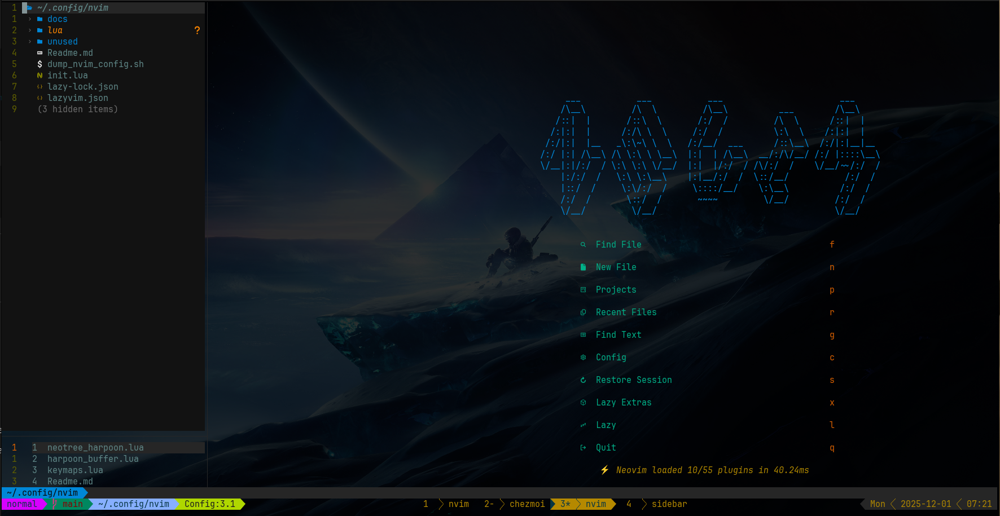

# harpoon-sidebar.nvim

A small Neovim plugin that automatically opens a **Harpoon 2 sidebar** under Neo-tree.
Whenever you open Neo-tree, a synchronized, read-only Harpoon list appears below it.

This plugin is built for **LazyVim + Harpoon 2 + Neo-tree** users who want to see their harpoon buffer names. Prime will hate this but I find it nice.

## Preview



## ✨ Features

* Automatically opens a Harpoon sidebar whenever Neo-tree opens
* Automatically closes the sidebar when Neo-tree closes
* Always stays in sync with Harpoon 2
* Read-only format (no accidental modification)
* Automatically resizes based on number of items
* Manual refresh via `<leader>hr`
* Zero dependencies other than Harpoon (harpoon2)

## 📦 Installation (Lazy.nvim)

```lua
{
  "NickStafford2/harpoon-sidebar.nvim",
  dependencies = { "ThePrimeagen/harpoon" },
  opts = {},
}
```

## ⚙️ Configuration

No configuration necessary.

However you can override the default keymap by disabling defaults:

```lua
{
  "NickStafford2/harpoon-sidebar.nvim",
  opts = {
    default_mappings = false,
  },
}
```

Then define your own mapping:

```lua
vim.keymap.set("n", "<leader>e", function()
  require("harpoon_sidebar.neotree").toggle()
end)
```

## ⌨️ Keymaps

| Key          | Action                               |
| ------------ | ------------------------------------ |
| `<leader>e`  | Toggle Neo-tree + Harpoon sidebar    |
| `<leader>hr` | Manually refresh the Harpoon sidebar |

You can disable these defaults if desired.

## 🧠 How It Works

1. When a Neo-tree buffer is opened, the plugin creates a split below it
2. The split contains a read-only buffer listing your Harpoon 2 items
3. The sidebar auto-resizes to match the number of entries
4. If you add/delete Harpoon entries, it updates instantly
5. When Neo-tree closes, the sidebar closes automatically

The plugin never overwrites real buffers and never steals focus unintentionally.

## 📁 File Structure

```
harpoon-sidebar.nvim/
├── lua/
│   └── harpoon_sidebar/
│       ├── init.lua
│       ├── sidebar.lua
│       └── neotree.lua
└── plugin/
    └── harpoon_sidebar.lua   ← default keymaps live here
```

## 🧪 Development

For local development:

```lua
{
  dir = "~/Projects/harpoon-sidebar.nvim",
  dev = true,
}
```

Then reload Neovim:

```
:Lazy sync
```

## 📜 License

MIT License
